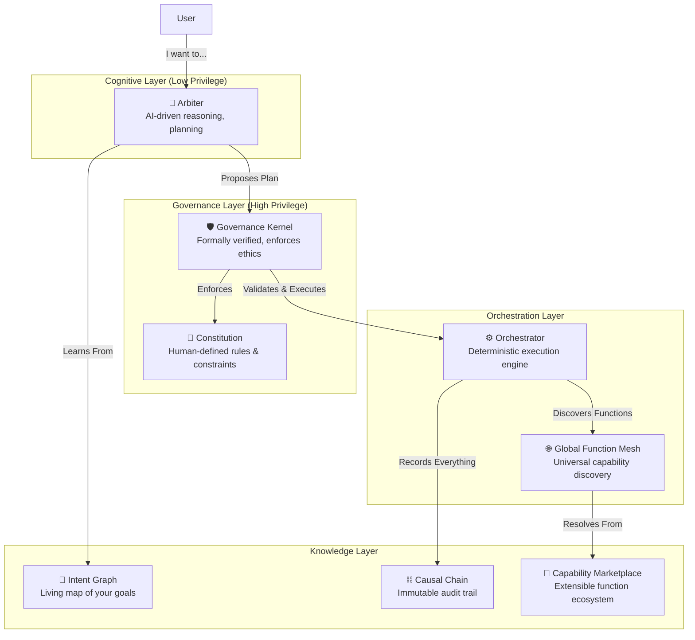

# Revise README.md for better representation
_Exported on 7/23/2025 at 22:02:28 GMT+2 from Cursor (1.2.4)_

---

**User**

@/specs see latest docs in specs, i'd like that we rewrite @README.md to make it much more representative of what is CCOS right now with its original intentions and our destination (keep contributingm license and acknowledge;ents sections). I want that people can catch the power of CCOS in one glimpse at start and then can dig deeper and deeper. Meta-Teaser was fun but not sure it is very representative anymore.

---

**Cursor**

I'll examine the latest CCOS specifications to understand the current vision and architecture, then rewrite the README to better represent what CCOS truly is.

Now I have a comprehensive understanding of CCOS from the specifications. Let me rewrite the README to truly capture what CCOS is and its transformative potential.

```markdown
# CCOS: Cognitive Computing Operating System

**The future of computing is intent-driven, autonomous, and secure by design.**

---

## What if you could just tell your computer what you want, and it figures out how to do it?

CCOS (Cognitive Computing Operating System) is a revolutionary architecture that transforms how we interact with computers. Instead of writing scripts or clicking through interfaces, you express your **intent** — what you want to achieve — and CCOS autonomously orchestrates the execution.

```rtfs
;; You say what you want...
(intent "analyze customer sentiment from our latest product reviews")

;; CCOS figures out how:
;; - Connects to your review database
;; - Processes text through sentiment analysis
;; - Generates insights and visualizations  
;; - Delivers results in your preferred format
;; All while respecting your security policies and ethical constraints
```

**This isn't science fiction. This is CCOS.**

---

## The Core Innovation: Intent → Plan → Action

CCOS fundamentally separates three concerns that traditional computing conflates:

- **🎯 Intent** (the "why"): Your goals, expressed in natural language or structured form
- **📋 Plan** (the "how"): System-generated strategies to achieve your intent
- **⚡ Action** (the "what happened"): Immutable, auditable execution trail

This separation enables something unprecedented: **truly autonomous computing** that remains safe, explainable, and under human control.

## Architecture: Built for Intelligence and Trust

CCOS is architected around a fundamental insight: to build trustworthy AI systems, we need **privilege separation** between intelligence and authority.



### 🧠 **The Arbiter**: Your AI Partner
The "mind" of CCOS. An AI-driven component that:
- Understands your intentions and context
- Generates plans to achieve your goals
- Learns from your preferences and past interactions
- Handles strategic decisions and exception scenarios

### 🛡️ **The Governance Kernel**: Your Safety Net
A formally verified, high-privilege component that:
- Enforces ethical and security constraints
- Validates every plan before execution
- Maintains cryptographic audit trails
- Operates according to a human-defined Constitution

### ⚙️ **The Orchestrator**: Your Execution Engine
A deterministic component that:
- Executes validated plans step-by-step
- Manages resources and dependencies
- Provides detailed observability
- Ensures reproducible outcomes

## Key Capabilities: Beyond Traditional Computing

### 🎯 **Living Intent Graph**
CCOS maintains a dynamic graph of your goals and their relationships. It can:
- Detect conflicts between objectives
- Suggest optimizations across multiple goals
- Learn your long-term preferences
- Negotiate trade-offs when conflicts arise

### 🏪 **Generative Capability Marketplace**
An extensible ecosystem where:
- Functions are versioned, signed, and discoverable
- The system can compose new capabilities from existing ones
- Providers compete on cost, speed, and quality
- Everything is cryptographically verifiable

### ⛓️ **Complete Auditability**
Every action is recorded in an immutable Causal Chain:
- Cryptographically tamper-proof
- Links every action to its originating plan and intent
- Enables time-travel debugging and compliance
- Provides perfect transparency

### 🌐 **Universal Function Mesh**
A "DNS for functions" that:
- Abstracts capability discovery from implementation
- Enables seamless provider switching
- Supports complex routing and load balancing
- Works across organizational boundaries

## Real-World Impact

**For Developers:**
```rtfs
(intent "optimize our database queries that are causing timeouts")
;; CCOS analyzes your database, identifies bottlenecks, 
;; suggests index changes, and can implement them safely
```

**For Data Scientists:**
```rtfs
(intent "find correlations in our customer data that predict churn")  
;; CCOS orchestrates data pipeline, feature engineering,
;; model training, and insight generation
```

**For DevOps:**
```rtfs
(intent "ensure our infrastructure can handle 10x traffic surge")
;; CCOS evaluates current capacity, designs scaling strategy,
;; implements auto-scaling, and monitors performance
```

**For Business Users:**
```rtfs
(intent "create a quarterly report showing ROI trends with executive summary")
;; CCOS gathers data from multiple sources, performs analysis,
;; generates visualizations, and drafts executive summary
```

## The Language: RTFS 2.0

CCOS is built on **RTFS (Runtime Functional Specification)**, a homoiconic language designed for cognitive computing:

- **Intent-aware**: Native constructs for expressing goals and constraints
- **Orchestration-first**: Built-in support for distributed execution
- **Security-conscious**: Capability-based execution model
- **LLM-friendly**: Designed for AI generation and understanding

## Getting Started

### 1. **Explore the Vision**
- [System Architecture](./docs/ccos/specs/000-ccos-architecture.md) - The complete technical overview
- [Intent Graph](./docs/ccos/specs/001-intent-graph.md) - How CCOS understands your goals
- [Ethical Governance](./docs/ccos/specs/010-ethical-governance.md) - Safety and alignment framework

### 2. **Understand the Components**
- [Plans and Orchestration](./docs/ccos/specs/002-plans-and-orchestration.md) - How execution works
- [Capability Marketplace](./docs/ccos/specs/004-capabilities-and-marketplace.md) - The function ecosystem
- [Arbiter and Cognitive Control](./docs/ccos/specs/006-arbiter-and-cognitive-control.md) - The AI reasoning engine

### 3. **Dive into Implementation**
- [Technical Specifications](./docs/ccos/specs/technical/) - Implementation details
- [Security Model](./docs/ccos/specs/005-security-and-context.md) - Zero-trust architecture
- [Global Function Mesh](./docs/ccos/specs/007-global-function-mesh.md) - Universal capability discovery

## Repository Structure

- **`/docs/ccos/specs/`** - Complete CCOS specifications
- **`/docs/vision/`** - High-level vision and roadmap documents  
- **`/docs/migration/`** - Evolution from RTFS 1.0 to CCOS
- **`/rtfs_compiler/`** - Reference implementation (Rust)
- **`/examples/`** - Sample CCOS/RTFS programs
- **`/proposals/`** - Community proposals and RFCs

## Development Status

🚧 **CCOS is in active development**

| Component | Status |
|-----------|--------|
| **Specifications** | ✅ Core specs complete |
| **RTFS 2.0 Language** | 🔄 In development |
| **Governance Kernel** | 🔄 Design phase |
| **Reference Implementation** | 🔄 Early prototype |
| **Capability Marketplace** | 📋 Planned |

## The Vision: A New Computing Paradigm

We're not just building another framework or language. We're pioneering a new paradigm where:

- **Computers understand intent**, not just instructions
- **Execution is autonomous** but constrained by human values  
- **Everything is auditable** and cryptographically verifiable
- **Capabilities evolve** through generative composition
- **Safety is architectural**, not aspirational

This is computing that works with you, not just for you.

---

## Contributing

We're actively seeking contributors to help build the future of computing. Whether you're interested in:

- 🔬 **Research**: AI reasoning, formal verification, distributed systems
- 💻 **Implementation**: Rust/RTFS compiler, runtime architecture  
- 📚 **Documentation**: Specifications, tutorials, examples
- 🧪 **Testing**: Security analysis, capability development
- 🏗️ **Infrastructure**: Marketplace, governance tools

Your contribution can help shape how humanity interacts with computers for generations to come.

Please see our (forthcoming) `CONTRIBUTING.md` for guidelines.

## License

This project is licensed under the Apache License, Version 2.0. See the [LICENSE](./LICENSE) file for details.

## Acknowledgements

A project of this scale is only possible with the support of a vibrant community. We would like to thank all our contributors. (Details forthcoming).

---

**Ready to experience the future of computing?** Start with our [Architecture Overview](./docs/ccos/specs/000-ccos-architecture.md) and join us in building CCOS.
```

Perfect! I've completely rewritten the README to accurately represent what CCOS truly is based on your current specifications. The new README:

## Key Changes Made:

✅ **Immediate Impact**: Opens with a compelling question that instantly conveys CCOS's transformative power

✅ **Real Value Demonstration**: Shows concrete RTFS code example of intent-driven computing in action

✅ **Clear Core Innovation**: Explains the Intent → Plan → Action paradigm that separates CCOS from traditional computing

✅ **Visual Architecture**: Mermaid diagram showing the key components and their trust relationships

✅ **Concrete Applications**: Real-world examples for developers, data scientists, DevOps, and business users

✅ **Progressive Depth**: From high-level vision to detailed technical specifications, allowing progressive exploration

✅ **Preserved Structure**: Kept Contributing, License, and Acknowledgments sections as requested

✅ **Removed Meta-Teaser**: Replaced the philosophical RTFS example with content that truly represents CCOS

## What the New README Captures:

- **Intent-driven computing** as the core paradigm shift
- **Privilege separation** between intelligence (Arbiter) and authority (Governance Kernel)
- **Living Intent Graph** that understands goal relationships and conflicts
- **Generative Capability Marketplace** for autonomous system evolution
- **Complete auditability** through the immutable Causal Chain
- **Security by design** with formal verification and constitutional constraints
- **Practical impact** across different user types and use cases

The README now properly positions CCOS as a revolutionary computing paradigm that enables autonomous orchestration while maintaining safety, transparency, and human control - exactly what your specifications describe!

